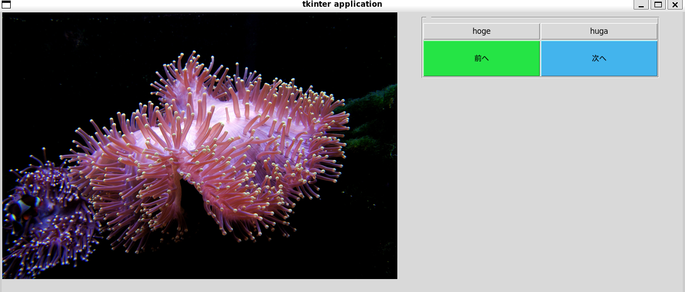

写真の仕分け作業を行うアプリケーションです。
[まとめ](まとめ)内に仕分け先のフォルダを作成した状態で `python main.py <仕分け対象ディレクトリ名>`で実行します。仕分け対象ディレクトリには仕分けたい写真を入れておきます。仕分け対象ディレクトリは再帰的に探索されます。

「次へ」ボタンを押していくことで写真が1枚ずつ表示されます。
右に表示されているトグルボタンをONにした状態で「次へ」を押すことで写真が仕分け先のディレクトリにコピーされます。

